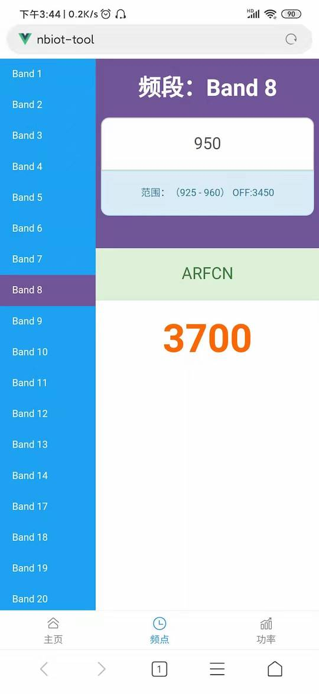

# nbiot-tool-mobile

本工具是无线测试换算工具。

现已开发完成功率转换，频点换算等，后续会增加其他工具。

> 项目使用Vue开发，如果你有想法或工具代码，欢迎添砖加瓦。

## 效果图

频率转换


功率转换


## npm 命令

```shell
# 启动本地服务
npm start

# 启动服务并监听 vite.config.js 变化
npm run dev

# 预览
npm run serve

# 生产打包
npm run build

# 测试打包
npm run build:dev

# 生产打包并压缩
npm run zip

# git自动化提交
npm run git
```

### Customize configuration

See [Configuration Reference](https://cli.vuejs.org/config/).

### 介绍

此项目使用 `Vite 2.x` + `Vue 3.x` 构建，集成了以下功能：

1. `vue-router`路由，配置了`路由懒加载`，全局`路由守卫`，组合式API中路由跳转，参数获取。
2. `vuex`状态管理，配置命名空间（`namespaced`）的业务模块（`modules`），`vuex actions`异步状态流管理。
3. `axios`实例全局引用。
4. `vant`移动端组件库。
5. `lib-flexible`+`rem`移动端适配，默认为`375px`设计稿的适配，若是`750px`的设计稿可调整`remUnit`的值，轻松适配。
6. `sass`预处理器。
7. `vue.config.js`本地跨域处理，更改对应的`url`和`path`即可使用。
8. `nodemon`动态监听`vue.config.js`，有更改自动重启服务，执行`npm run dev`时生效。
9. `Composition API`（`<script setup>`）搭配`ref`和`reactive`数据绑定、`computed`计算属性、`watch`监听、`props`组件传参等等常用API的使用都有完整事例，以供参考。
10. 配置了 `tive-cli` 自动化执行shell脚本功能。提示： `tive-cli` 需要使用 `npm i -g tive-cli` 全局安装。
11. 自动化打包和zip压缩。
12. 提供了 `WebAssembly`（`Wasm`）使用案例，以及对应的交互展示页面。
