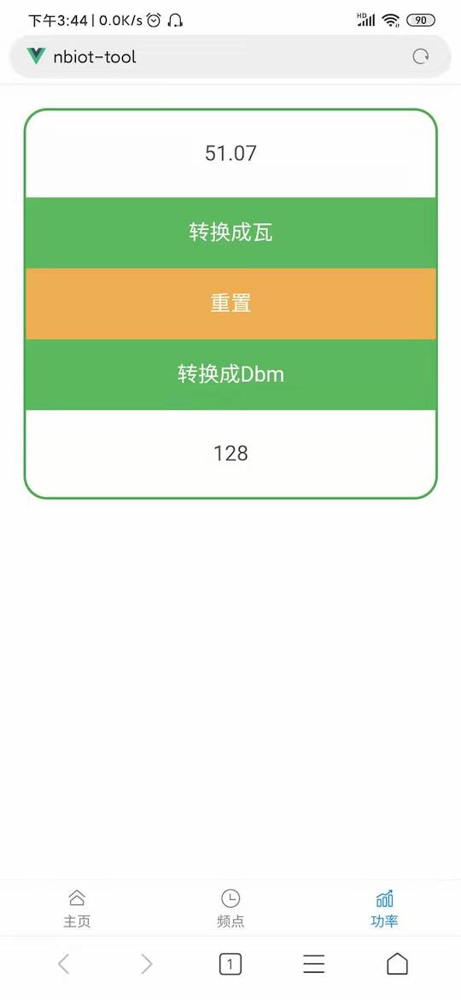

# nbiot-tool-mobile

本工具是为NB-Iot做功率，频率换算的工具，后续为增加其他使用的工具。

## 效果图

频率转换


功率转换


## Project setup
```
npm install
```

### Compiles and hot-reloads for development
```
npm run serve
```

### Compiles and minifies for production
```
npm run build
```

### Lints and fixes files
```
npm run lint
```

### Customize configuration
See [Configuration Reference](https://cli.vuejs.org/config/).
